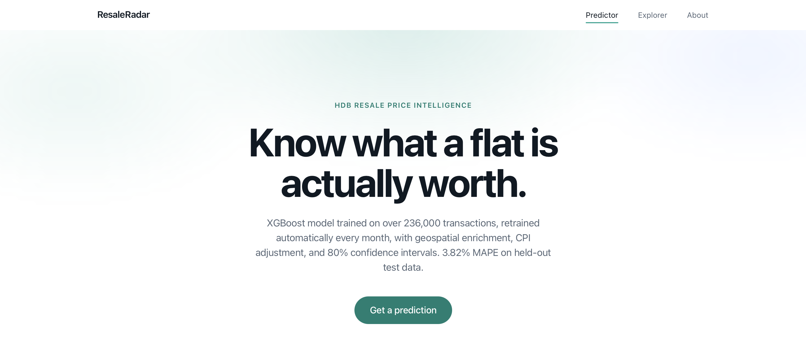
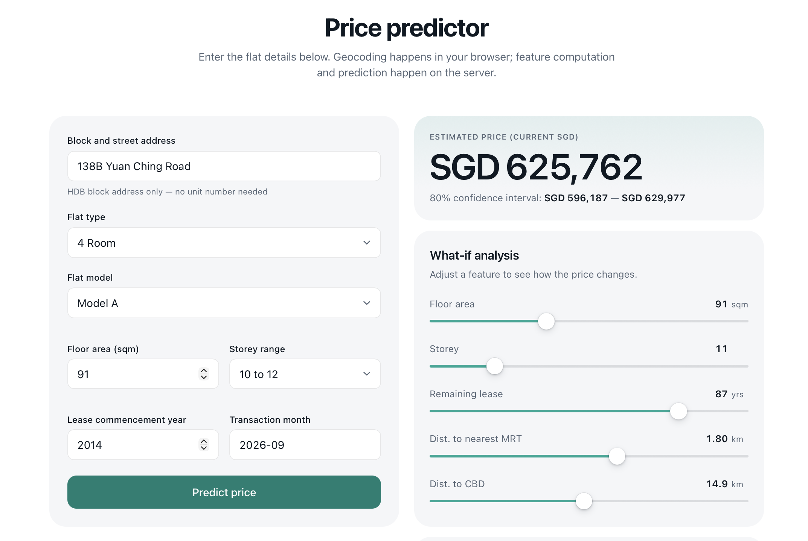
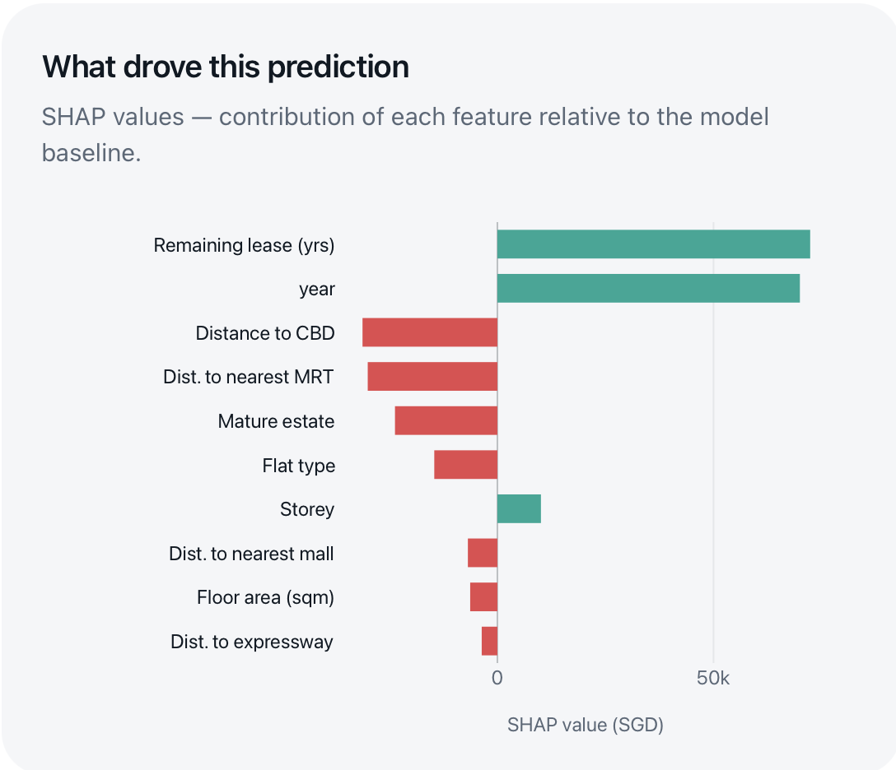
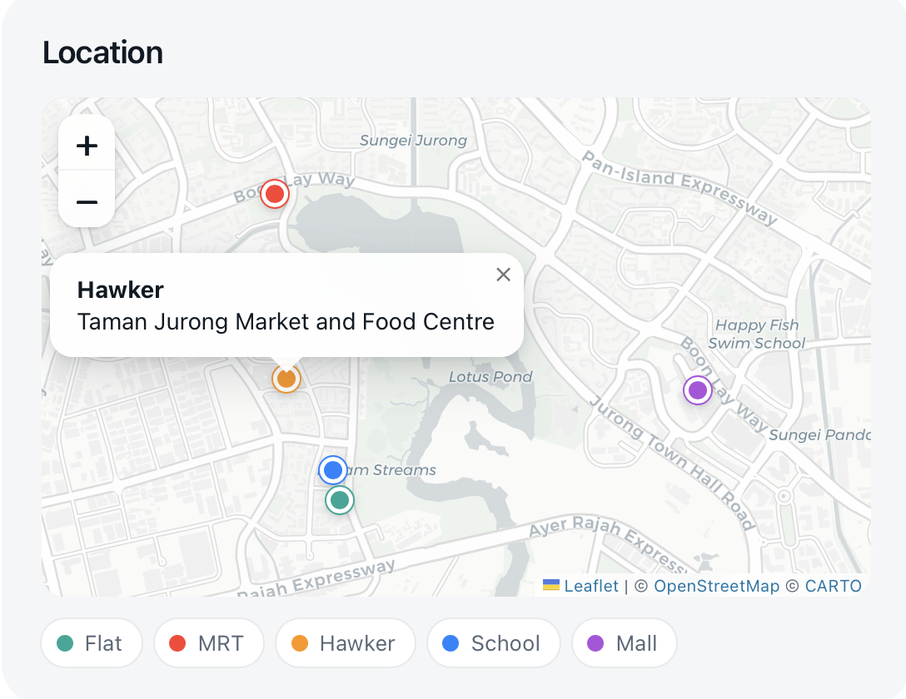
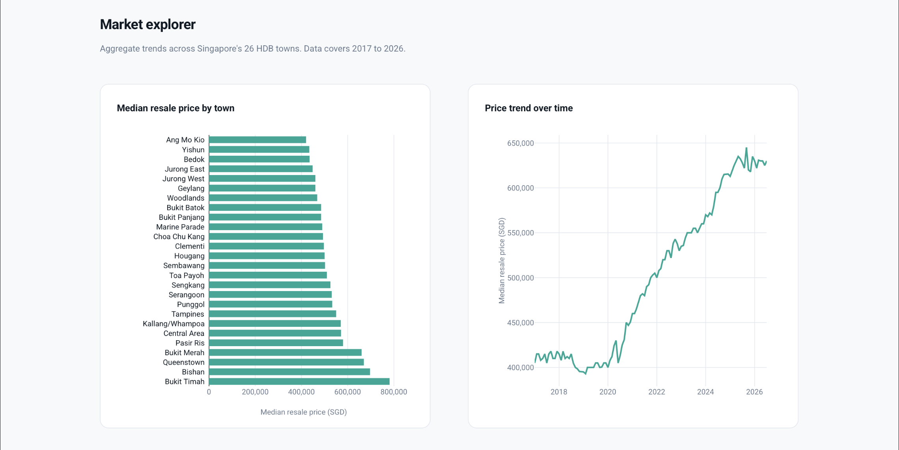
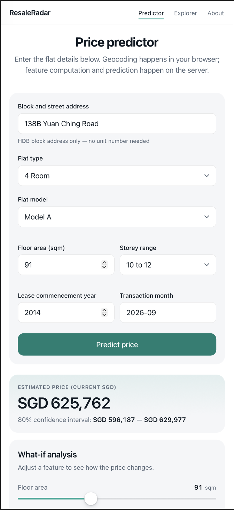
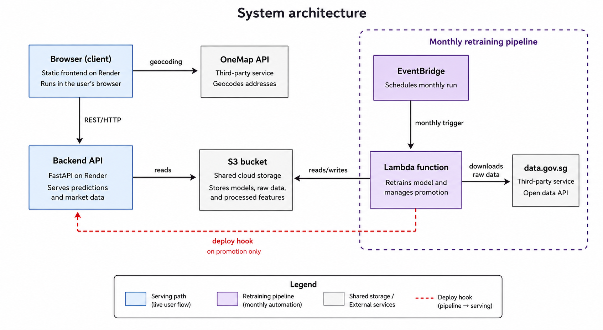

# ResaleRadar

HDB resale price predictor for Singapore, with monthly automated retraining on fresh government data.

**Live demo:** https://resaleradar-frontend.onrender.com

## Overview

ResaleRadar predicts resale prices for HDB flats in Singapore using XGBoost, trained on transaction data from data.gov.sg going back to 2017. Beyond the prediction itself, the project's main focus is the infrastructure around it: a serverless pipeline on AWS that downloads fresh transaction data every month, regenerates geospatial features, retrains the models, and only promotes a new model if it actually performs better than the one currently live. If it does, the live backend redeploys automatically and starts serving from the new model.

This was built as a portfolio project, but the goal from the start was to make the automation genuinely real rather than something built once and screenshotted. The pipeline has fired on its own schedule and produced a real promotion, verified against actual CloudWatch logs, not just a manual test run.

## Key features

- Price prediction with an 80% confidence interval, built from three separate XGBoost quantile models (10th, 50th, 90th percentile)
- SHAP explanations showing which features drove each prediction
- What-if sliders for floor area, storey, remaining lease, distance to MRT, and distance to CBD, with live re-prediction
- A map showing the predicted flat alongside its nearest MRT station, school, hawker centre, and mall
- Market Explorer tab: median resale price by town and price trend over time, computed from live transaction data
- Fully automated monthly retraining, with a champion/challenger check that only promotes a new model if it beats the currently live one

## Screenshots



|                                                            |                                                            |
| ---------------------------------------------------------- | ---------------------------------------------------------- |
|  |  |
|   |    |



## Demo video

[](https://www.youtube.com/watch?v=VIDEO_ID)

▶ Click to watch (158s, no audio)

## Architecture



At a high level: an EventBridge rule triggers a containerized Lambda function once a month. The Lambda downloads fresh transaction and CPI data from data.gov.sg, regenerates all geospatial features, retrains four XGBoost models, and compares the new candidate's test MAPE against whatever's currently live. If it's better, it overwrites the live models in S3 and calls a Render deploy hook. Render then rebuilds and restarts the backend, which loads the newly promoted models from S3 at startup.

The frontend never talks to AWS directly. It calls the FastAPI backend, which is the only thing with AWS credentials.

## Tech stack

**Model:** XGBoost (baseline + q10/q50/q90 quantile regression), SHAP for explainability

**Backend:** FastAPI, boto3, Pydantic

**Frontend:** Vanilla HTML/CSS/JS, Plotly, Leaflet

**AWS:** S3, Lambda (container image via ECR), EventBridge, IAM

**Hosting:** Render (backend as a Web Service, frontend as a Static Site)

**Data sources:** data.gov.sg (HDB resale transactions, CPI), OneMap API (geocoding), SLA National Map (expressway geometry)

## How prediction works

The API accepts what a user actually knows about a flat (address, floor area, storey, flat type, lease commencement year) rather than pre-computed features. The backend geocodes the address client-side via OneMap, then computes all 69 model features server-side: 15 geospatial distance and count features calculated via Haversine distance against six amenity datasets (MRT stations, schools, malls, hawker centres, bus stops, expressways), plus flat attributes and one-hot encoded town and flat model.

Town is inferred server-side via nearest-neighbour lookup against roughly 9,700 geocoded HDB blocks, rather than asking the user to select it, since a mismatched user-selected town and address would produce a contradictory input.

MRT stations and hawker centres are filtered by their opening or completion date relative to the transaction date, so a station that opened after a transaction doesn't count toward that transaction's features. This matters for a training set spanning 2017 to the present.

## Model details

Four XGBoost models are trained each cycle: a baseline model (squared error loss) and three quantile regression models (10th, 50th, 90th percentile). The baseline exists solely to compute SHAP values, since TreeExplainer works most cleanly against a mean-optimizing model. The prediction shown to users is always q50, with q10 and q90 forming the 80% confidence interval, so all three bounds come from the same loss family.

Training prices are converted to a fixed 2024-dollar basis before training (`resale_price_real = resale_price × (base_cpi / transaction_cpi)`), using SingStat's monthly CPI data. This keeps the training target free of pure inflation drift. The frontend converts the model's output back to current dollars at display time using the same base value and the latest CPI reading.

Remaining lease is enforced to be monotonically related to price (a shorter lease should never predict a higher price) via monotonic constraints at training time, layered with a deterministic isotonic regression correction at serving time. XGBoost's monotonic constraints don't fully enforce under the quantile regression loss function, a documented limitation, so the isotonic correction is what actually guarantees it.

Validation scripts in `tests/` (`test_monotonic.py`, `evaluate.py`) check monotonicity and accuracy against real listings. These are run manually rather than as part of CI, which is on the list of future work below.

### Current performance (live model, last promoted retrain)

- q50 test MAPE: 3.82%
- q50 test RMSE: SGD 30,708
- 69 features, roughly 236,900 training rows

These numbers move slightly every time the pipeline retrains. The current live figures are recomputed monthly and stored in `models/metrics.json` in S3.

## Automated retraining pipeline

Once a month, an EventBridge rule triggers a Lambda function that:

1. Downloads the latest HDB transaction and CPI data from data.gov.sg
2. Regenerates all geospatial features from the fresh data (chunked, vectorized numpy operations rather than a row-by-row loop, to stay within Lambda's memory and timeout limits)
3. Retrains all four models
4. Compares the new candidate's q50 test MAPE against the currently live model's recorded metrics
5. If the candidate is better, promotes it to S3 and triggers a Render deploy hook

The training instance quota for AWS SageMaker Training Jobs is blocked on a new-account fraud-prevention default, with an appeal still pending. Rather than wait on that indefinitely, the pipeline was built on Lambda instead, since a model this size trains in well under a minute regardless of platform. `scripts/train.py` still exists as a SageMaker script-mode entry point in case that path ever gets unblocked, but it isn't part of the live pipeline.

## Project structure

```
resaleradar/
├── backend/
│   ├── main.py         # FastAPI app: /health, /predict, /market-data
│   ├── model.py         # Loads models from S3, computes features, runs prediction + SHAP
│   ├── market.py         # /market-data: town medians, price trend, CPI
│   └── schemas.py         # Request/response models
├── frontend/
│   ├── index.html
│   ├── styles.css
│   └── app.js
├── lambda/refresh_data/    # Monthly retraining pipeline (container-based Lambda)
│   ├── features.py         # Geospatial + CPI feature engineering
│   └── retrain.py           # Training + champion/challenger promotion
├── notebooks/            # 01 through 07, the original development/EDA notebooks
├── scripts/              # SageMaker script-mode training path (not currently used)
├── models/               # Local copies of trained models (dev reference only)
├── tests/                # Manual validation scripts (monotonicity sweep, accuracy check)
└── data/
    ├── raw/
    └── processed/
```

## Running locally

Requires Python 3.12 and AWS credentials with read access to the `resaleradar` S3 bucket (ap-southeast-1), since the backend loads models and market data from S3 rather than local files.

```bash
git clone https://github.com/XiyanM/resaleradar.git
cd resaleradar
python3 -m venv venv
source venv/bin/activate
pip install -r backend/requirements.txt
```

Set AWS credentials, either via `aws configure` or environment variables:

```
AWS_ACCESS_KEY_ID=...
AWS_SECRET_ACCESS_KEY=...
AWS_DEFAULT_REGION=ap-southeast-1
```

Then, in two terminals:

```bash
# Terminal 1
uvicorn backend.main:app --reload

# Terminal 2
cd frontend
python -m http.server 3000
```

Open `http://localhost:3000`.

## Known limitations

- Doesn't capture unit-level factors like interior condition, renovation, or facing direction, which can account for SGD 20,000 to 50,000 in price difference between otherwise similar units
- Confidence intervals reflect model uncertainty, not full market uncertainty
- New HDB blocks that were never geocoded in the original address pass are dropped from monthly retraining rather than being re-geocoded automatically. This affects roughly 0.01% of transactions per run.
- A promoted model only reaches the live site on the backend's next restart, triggered by the Render deploy hook. There's no hot-swap of a running process.
- No dedicated drift-tracking metric yet. The champion/challenger check protects against promoting a worse model, but there's no running series tracking the live model's accuracy against new transactions over time.

## Possible future work

- MLflow experiment tracking for the monthly retraining runs
- A walk-forward backtest across the full 2017 to 2026 dataset
- A dedicated drift-tracking metric for the live model specifically
- Automated test suite (pytest) and CI
- Dockerizing the FastAPI backend

## License

MIT. See [LICENSE](LICENSE).
